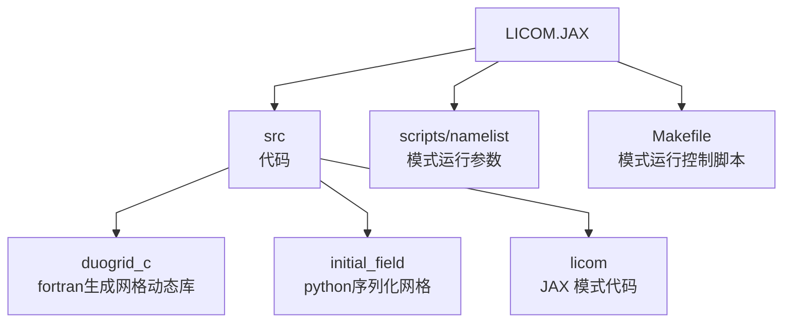

## Licom JAX Version移植说明

<span style="font-family: 'Caveat', cursive; font-size: 20px;">
  Chtholly 2026.8.16
</span>

#### 1.文件结构


##### (1) ```src/duogrid_c``` 生成网格参数的动态运行库
  (a) 使用fortran生成网格  
  (b) 将生成网格绑定c接口供python外部调用  
  (c) 通过cmake编译成动态链接库如lib/libduogrid_coordinate.dylib  

##### (2) ```src/initial_field``` python调用c动态库读取网格参数后进行序列化
  (a) 给定分辨率,python调用lib/libduogrid_coordinate.dylib,生成网格参数的numpy数组  
  (b) 将生成的numpy数组序列化为例如field/duogrid_C96.npz,对于对于每个需要使用指定分辨率的生成网格参数文件  

##### (3) ```src/licom``` jax模式代码

##### (4) ```scripts/namelist``` 模式运行参数

##### (5) ```Makefile``` 模式运行控制脚本


#### 2.移植步骤(以正压为例)

##### step 1.参考src/licom/datatype/momentum_data.py,为MomentumData类定义GPU数组

##### step 2.参考src/licom/momentum/barotr_pure.py,将正压计算改写成jax纯函数

##### step 3.参考src/licom/momentum/barotr.py, 参考函数_barotr_rk2_core,使用上一部分定义的纯函数,将正压积分过程抽象为 _function(state, consts, *python_variable)
  (1) state 为正压积分中需要更新的定义在GPU上的jax数组(tensor)字段,例如u, h0  
  (2) consts 为正压积分中无需更新,只被引用的GPU上的jax数组(tensor)字段,例如rdx,rdy  
  (3) *python_variable 为正压积分中使用的python端参数变量列表,例如dtb,nbb

##### step 4.src/licom/mymodule/schedule.py 执行侧完善
  (1) 为STATE_KEYS,CONST_SOURCES 补充完整字段  
  (2) schedule_core函数添加JIT块内部调用的所有过程的纯函数  
  (3) configure函数中使用src/licom/kernel/spmd.py的autopack函数将momentum的指针打包  
  (4) configure函数中使用src/licom/kernel/spmd.py的make_spmd_jit函数编译  


#### 3.TODO

##### (1) 目前完成了正压的移植和W92case2测试,后续需要移植redayc, readyt, bclinc, tracter, (isopyc, vmix)

##### (2) 功能性缺少netcdf结果输出,添加参考src/licom/mymodule/diag.py,该部分按照异步多线程交由host侧处理

##### (3) 通信部分代码位于src/licom/kernel/communication.py和cube.py.提供ext_scalar/ext_vector函数实现halo区交换和boundary_communication函数实现棱线平均.目前通信基于lax.all_gather实现gpu间规约操作.小规模8卡测试表明,有nvlink的全互联GPU节点,对数据打包后单次通信效率可能高于多次点对点通信,但是大规模GPU结果可能相反,故后续可能需要对通信添加lax.ppermute的点对点通信泛型


#### 4.设计思路

##### 模型的架构设计主要分为三部分:(1)初始化阶段与(2)时间积分阶段 (3)异步I/O

(1)初始化阶段主要完成数据结构与通信算法的构建.首先是数据结构初始化,系统将所有GPU硬件资源逻辑化,组织为(ptile, px, py)的三维网格拓扑结构.接着Host读取全局网格参数与初始物理场,并通过JAX的Sharding分片机制,根据各变量的数据维度特征,将其分片并驻留至拓扑中对应的GPU显存中.其次是通信算法初始化,系统通过预先定义立方球网格中的面间与面内两类拓扑规则,预构建每张GPU局地Halo区的边界交换通信路由表  
(2)初始化完成后,程序进入主体时间积分阶段.首先,所有离散化方程均被重构为无副作用的JAX纯函数,并基于shard_map建立函数的数据切片签名,在编译阶段显式声明每个计算函数的数据输入、输出及分布方式,使每个计算函数仅作用于单张GPU的局地数据块,计算过程仅访问本地显存数据,避免跨卡全局内存访问.这一过程精确控制数据流向与通信边界,将跨设备数据交换严格限制在必要的Halo区更新和边界通量同步环节.随后,通过fori_loop控制流封装完整时间循环.JIT编译后,多个时间步被融合到同一轮执行图中,积分过程无需逐步返回Python解释器进行调度,而是在GPU上连续执行.仅在诊断变量输出、历史场保存及运行监控等必要节点触发Host端同步,有效降低解释器开销和CPU-GPU通信成本.JAX端高级抽象代码最终被降级为针对目标GPU架构的高性能静态机器码,从而实现大规模异构平台上的高效并行时间积分推进  
(3)对于异步I/O卸载设计,在GPU侧,所有迭代步骤被封装为无副作用的JAX纯函数,并通过jax.for_loop配合jax.jit(shard_map)将多个时间步迭代融合为一个完整的计算轮次.在一个轮次内,所有计算均连续驻留于GPU设备端执行,不发生Host参与和数据回传,从而最大程度发挥JIT编译后的计算效率.当一个Round完成后,GPU仅对需要输出的诊断变量和状态变量进行统一打包,并立即发起显存到主机内存的异步数据拷贝(Trigger Device-to-Host Async Copy).数据传输请求提交后,GPU无需等待数据复制结束,而是直接进入下一轮时间积分计算,实现计算过程与数据传输过程的解耦.在Host侧采用多任务队列与线程池机制构建了完善的异步I/O流水线.系统通过队列实现数据的缓冲与分发:主线程持续收集GPU回传的模拟结果,封装为任务对象并入队；后台线程池则作为消费者,从队列中并发提取任务,依次完成诊断变量后处理、系统日志记录以及NetCDF格式的数据落盘.这种流式处理设计确保了前后端数据交接的平滑与高效  

##### 核心部分GPU多卡划分和通信的实现位于src/licom/kernel


#### 5.运行

##### (1)获取代码
```bash
git clone git@github.com:TomoriNao23/licom4py_gpu.git
```

##### (2)安装依赖 cmake, makefile, python, jax. Nvidia平台参考
```bash
sudo apt update
sudo apt install python3.10-venv cmake makefile -y

python3 -m venv jax_env

source jax_env/bin/activate

pip install -U pip

pip install -U "jax[cuda12]” -f https://storage.googleapis.com/jax-releases/libtpu_releases.html
```

#####  (3)编译动态库
```bash
cd ./src/duogrid_c
mkdir build
cd build
cmake ..
make -j4
```

#####  (4)根据scripts/namelist序列化网格参数并运行模式
```bash
#进入根目录
make field
make
```
